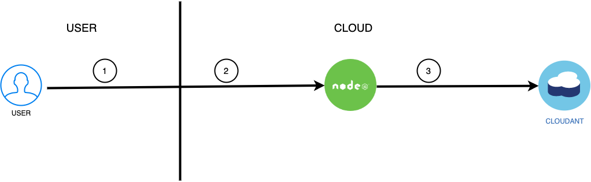
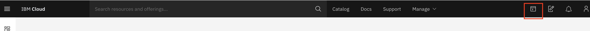

# IBM Cloud Foundry 

## Description

This project is a demonstration of Node.js Microservices and Container-to-Container networking on IBM Cloud Foundry Public. It involves two distinct microservices in combination with a Cloudant NoSQL database API which provide a simple 'Guestbook' functionality to the user. 

## Table of Contents

- [Architecture](#architecture)
- [Repository](#repository)
- [Deployment](#deployment)
  - [Prerequisites](#prerequisites)
  - [Local Setup](#local-setup)
  - [Using IBM Cloud Shell](#cloud-shell)
  - [Guestbook-Main](#guestbook-main)
  - [Local Testing (optional)](#local-testing-optional)
    - [Deploying Guestbook-Main locally](#deploying-guestbook-main-locally)
- [License](#license)

## Architecture



1. The frontend/interface for the user is served by the "guestbook-main" application (left Node.js application)
2. Backend API calls for creating a new guestbook entry, retrieving of entries and retrieving of images
3. Save/Retrieve entries in/from the connected Cloudant database

## Repository

This repository includes both microservices/Node.js applications, "guestbook-main"  which is saved in the same called sub-directories. Hereby, "guestbook-main" is responsible for the basic functionality of the guestbook (HTML, create, list, database connection) 

- [Detailed Information about Guestbook-Main and Troubleshooting](guestbook-main/README.md)
- [Detailed Information about Guestbook-Watson](guestbook-watson/README.md)

## Deployment

### Prerequisites

- Install the latest version of the IBM Cloud CLI: [IBM Cloud CLI Tutorial](https://cloud.ibm.com/docs/cli?topic=cloud-cli-getting-started)
- If not present, create Account on IBM Cloud: [IBM Cloud Registration](https://ibm.biz/BdqaJE)
- Create an organization and space for Cloud Foundry: [CF Org and Space Creation Manual](https://cloud.ibm.com/docs/account?topic=account-orgsspacesusers)
- Log into your Cloud Foundry organization and space: [CF Org and Space Configuration Tutorial](https://cloud.ibm.com/docs/cli?topic=cloud-cli-getting-started#step3-configure-idt-env)
- Install the latest version of Git: [Git Download Page](https://git-scm.com/downloads)

### Local Setup

1. First, open a terminal in a directory of your choice on your local computer.
2. Clone this Git repository by using the command: `git clone https://github.com/IBMDevConnect/cf-nodejs-c2c-demo.git`.
3. Following, use the command `cd cf-nodejs-c2c-demo` to navigate into the project directory.

OR 

### Using IBM Cloud Shell

1. In the IBM Cloud console, click the IBM Cloud Shell icon IBM Cloud Shell icon. A session starts and automatically logs you in 
through the IBM Cloud CLI.


2. Clone this Git repository by using the command: `git clone https://github.com/IBMDevConnect/cf-nodejs-c2c-demo.git`.
3. Following, use the command `cd cf-nodejs-c2c-demo` to navigate into the project directory.

### Guestbook-Main

1. Go to the IBM Cloud "Catalog" by clicking on the same-named navigation item on the IBM CLoud Dashboard or by opening the following link: [https://cloud.ibm.com/catalog](https://cloud.ibm.com/catalog)
2. Search for the product "Cloudant" in the search bar or go to the "Databases" section directly.
3. Click on the product card "Cloudant" to provision a new Cloudant NoSQL database.
4. Fill out the form for the database creation:

- **Region/Location** - To reduce latency, use the same region/location as of your CF space.
- **Pricing Plans** - Select your prefered pricing plan and memory. The Lite plan is sufficient for our needs.
- **Service name** - To keep it simple, we will use the name `guestbook-database` for this service.
- **Tags** - Add the tag `guestbook` to find your resources more easily.
- **Authentication Methods** - Select the authentification method: `Use both legacy credentials and IAM` to enable HTTP authentification which is needed to send the requests to the database.

5. Click on the button "Create" to submit the form and create the database.

- You're redirected to the resource list. The provisioning might take up to 5 minutes. In the meantime, we are going to deploy the `guestbook-main` application.

6. Open your local terminal and navigate into the `directory "guestbook-main"` by using the command: `cd <Path to directory>`
7. Push the application to IBM Cloud using the CLI (installation see Prerequisites):

---
*** Cloud Foundry Login (can be skiped if you are already logged in with the CLI)

- Use the command `ibmcloud login -sso` to log into your IBM Cloud account using Single-Sign-On.
- **IF** the region in the output table does **NOT** accord your previously selected region/location for the "guestbook-main" application, use the command `ibmcloud login -sso -r <region>` to change it (for example: `ibmcloud login -sso -r eu-gb`) for London.
- Afterwards, target your CF organization and space using `ibmcloud target --cf`. This will complete your local configuration for pushing to Cloud Foundry.
---

- With the command `ibmcloud cf push` you can push (upload and deploy) your application to IBM Cloud Foundry now.
- After a successful push, you will see an output similar to this:

```shell
Waiting for app to start...

name:              guestbook-main
requested state:   started
routes:            <ROUTE>
last uploaded:     Fri 19 Jul 11:12:44 CEST 2019
stack:             cflinuxfs3
buildpacks:        SDK for Node.js(TM) (ibm-node.js-6.17.1, buildpack-v3.27-20190530-0937)

type:            web
instances:       1/1
memory usage:    128M
start command:   ./vendor/initial_startup.rb
     state     since                  cpu    memory          disk          details
#0   running   2019-07-19T09:13:01Z   0.5%   28.7M of 128M   63.5M of 1G
```

- You can copy the `<ROUTE>` value from the output now and open it in the browser to see the deployed Guestbook. Please notice that the application has no functionality yet because neither the database nor the seond service are connected.

8. Go back to the IBM Cloud Resource Overview ([https://cloud.ibm.com/resources](https://cloud.ibm.com/resources))
9. Make sure the status of "guestbook-database" in the "Services" section is `Provisioned`. You might have to reload the page.
10. Click on the "guestbook-database" name to go to the service dashboard.
11. In the sidebar of the service dashboard, click on the item "Connections".
12. Subsequently, on the connections page, click the button "Create connection" to create a new connection configuration between the application and the service.
13. After selecting the region/location of the previously created application (regeion you logged in with, displayed on `ibmcloud target`) in the filter of the table, you will see the application "guestbook-main" as an entry in the table.
14. Hover over the "guestbook-main" row to find the "Create" button and click on it.
15. In the form for creating the connection, you can stay with the default values. The "Access Role" should be `Manager`. Following, click on the "Connect & restage app" button.
16. You might have to confirm the restaging of the "guestbook-main" application in another popup.
17. In the table, under "Connected Applications", you will find "guestbook-main" as an entry.
18. Click on the "guestbook-main" row to go to the application dashboard.

- After the application is restaged/restarted, you can visit the App URL/Route again and create your first Guestbook entry. The tags are added after connecting the second application.


**You have successfully completed the tutorial now! 🎉 If you consider modifying the applications, you can go on with the "Local Testing" section**

## Local Testing (optional)

Local Testing is only necessary if you consider modifying the application code. In this case, you can very quickly restart the application to debug it more easily. 

### Deploying Guestbook-Main locally

In opposite to the second application of our example, "guestbook-main" does not require the second application to work. If the second application "guestbook-watson" is not available, it won't analyse the image to retrieve the tags but the remaining functionality of the Guestbook does not depend on it. Please notice that the terminal will display an HTTP error (status 404) in the case that the second application is missing which can be ignored.

1. Back in your browser, go to the application dashboard of "guestbook-main". (for example by navigation to the resource list [https://cloud.ibm.com/resources](https://cloud.ibm.com/resources) and clicking on the application name.
2. On the application dashboard of the "guestbook-main", click on "Connections" in the sidebar.
3. In the table, you will see the connection to the database "guestbook-database" as an entry. In its row, click on the 3 horizontal dots to open the menu.
4. In the menu, click on "View credentials" to open a popup with the credentials for this connection.
5. Copy the displayed code block either by clicking on the small copy icon or by selecting the code and copying it by using CTLR/CMD + C.
6. Open the previously cloned "cf-nodesjs-c2c-demo" project in the code editor of your choice and expand the `sub-directory "guestbook-main"`.
7. In it, you will find a file called `vcap-local.json.example`. Rename this file to `vcap-local.json` and paste the copied code behind `"services:"`.

- `vcap-local.json` is the local configuration for the connection to the database. It is automatically parsed on the start of the server and contains all connection information and credentials.
- After pasting, the file should look similar to this example:

```javascript
{
  "services": {
    "cloudantNoSQLDB": [
    {
      <connection information and credentials>
    }
  ]
}
}
```

- Afterwards, the application is ready to be tested. 🎉

8. In your terminal, navigate into the `directory "guestbook-main"` by using the command: `cd <Path to directory>`
9. Use the command: `npm install` to install all dependencies of the application locally. If Node.js is not installed, install the latest version on your machine (see Prerequisites).
10. Following, start the server using: `npm run dev`. This opens the server using the watcher `nodemon` which reloads the server on every file change.

- The expected output of this command looks something to this:

```shell
    ...
    Loaded local VCAP { services: { cloudantNoSQLDB: [ [Object] ] } }
    Successfully initialized cloudant client!
    [ENV] Server Port: 5000
    [ENV] Image Base Path: 
    [ENV] Watson Microservice: http://localhost:3000
    Listening on port: 5000, Link: http://localhost:5000
```

- The app should be reachable in your local browser by using the URL: [http://localhost:5000/](http://localhost:5000/)


## License
Apache 2.0. See [LICENSE.txt](LICENSE.txt)

> Licensed under the Apache License, Version 2.0 (the "License");
> you may not use this file except in compliance with the License.
> You may obtain a copy of the License at
>
> http://www.apache.org/licenses/LICENSE-2.0
>
> Unless required by applicable law or agreed to in writing, software
> distributed under the License is distributed on an "AS IS" BASIS,
> WITHOUT WARRANTIES OR CONDITIONS OF ANY KIND, either express or implied.
> See the License for the specific language governing permissions and
> limitations under the License.
